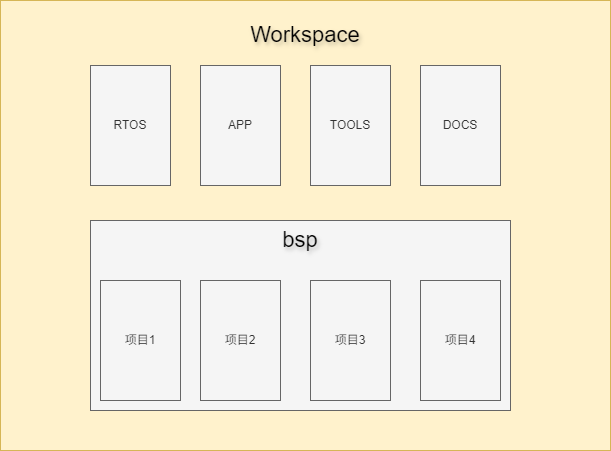
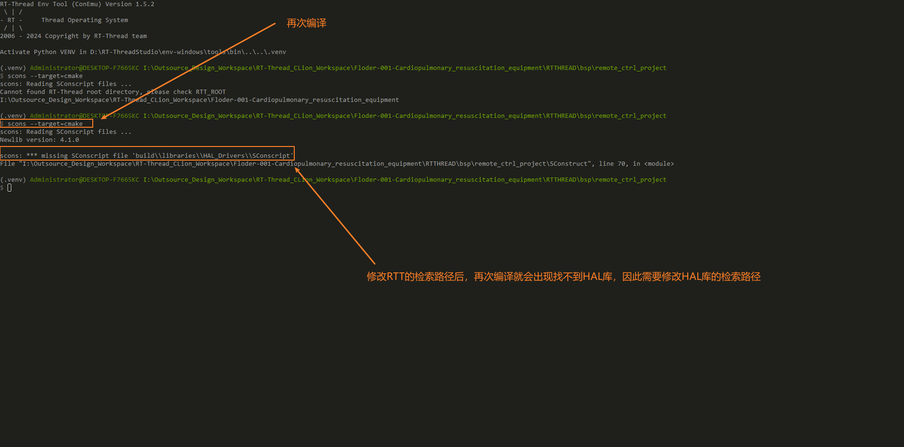
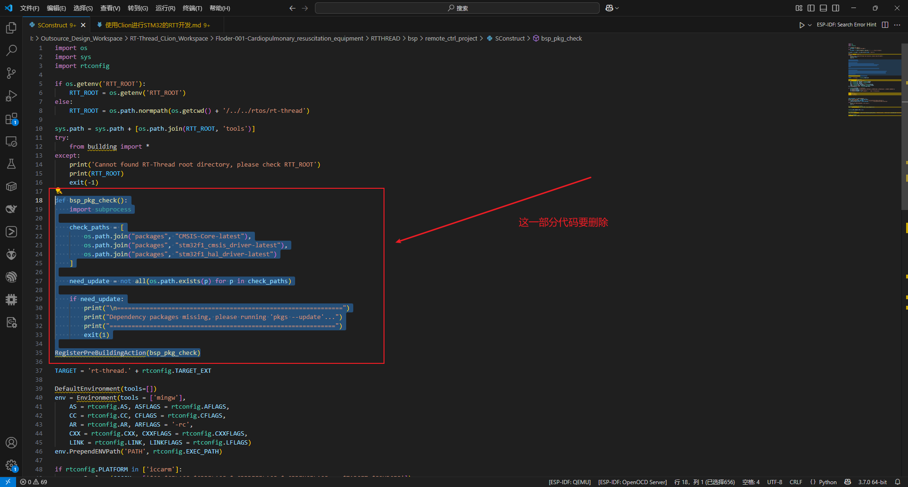
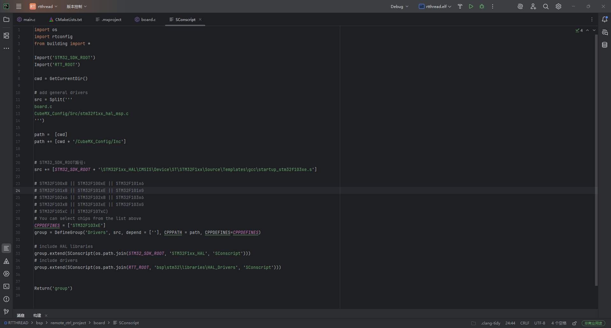

<style>
.red {
  color: #ff0000;
}
.green {
  color:rgb(10, 162, 10);
}
.blue {
  color:rgb(17, 0, 255);
}
</style>


# <span class="green"><font size=4>一、STM32-RTT构建</font></span>
```bash
create_at：2025/06/09
aliases：使用Clion进行STM32的RT-Thread开发
```
## <font size=2>1.RTT Studio 与 Clion 的差异</font>
```bash
1.Clion使用CMake,Make或者Makefile来构建项目
2.RTT使用scons来构建项目
```
## <font size=2>2.使用CLion构建RTT工程关心的核心问题</font>
```bash
1.用什么编译器：CLion自动捆绑或者自己安装的arm编译器（arm-none-eabi-gcc.exe）
2.编写CMakeLists.txt需要关注的要点
  ① 关心哪些源文件需要被编译 
  ② 关心头文件的搜索地址
  ③ 关心启动汇编文件
  ④ 关心链接文件
```


# <span class="green"><font size=4>二、建立以工作区为形式的开发环境</font></span>
## <font size=2>1.构建目录大纲</font>
<font size=2>为了方便将项目代码最小化管理，将rt-thread以及stm32系列单片机的Hal库文件均放置在rtos文件夹下，作为整个工作区的依赖库，然后在bsp文件夹下新建项目文件，以达到模仿rt-thread官方制作BSP板级项目的效果。新建目录大纲如下所示。<br>这样可以达到bsp文件夹内的所有项目可以共享上层路径中的RTOS、APP、TOOLS、DOCS的资源。</font>
```bash
E:.
├─apps                        # 存放上层app相关文件
├─bsp                         # 存放项目源码
│  └─project_demo1
├─docs                        # 存放项目文档
├─rtos                        # 存放一些库源码
│  ├─packages                 # rt-thread 的 组件 源码
│  ├─platform                 # 跨平台软件包源码
│  │  └─stm32_libraries
│  │      ├─STM32F1xx_HAL
│  │      ├─STM32F4xx_HAL
│  │      ├─STM32F7xx_HAL
│  │      └─STM32H7xx_HAL
│  └─rt-thread                # rt-thread 源码
└─tools                       # 工具插件脚本类源码
```



## <font size=2>2.下载必要的库文件以及工具</font>
<font size=2>使用CLion的CMake进行STM32项目构建，在此之前需要先下载几个必要的库文件，分别是rt-thread操作系统源码、STM32_HAL库源码、rt-thread的软件组件包源码等。除此之外，需要注意的是CLion使用的CMake是基于gcc编译器，而RTT编译使用的Scons是基于python编译器进行的。因此，需要额外安装rtt官方的env工具，将Cmake与Scons联合。</font>

<font size=2>[rt-thread官方env工具下载链接](https://www.rt-thread.org/download.html#download-rt-thread-env-tool "rtt官方链接")

[rt-thread的操作系统源码github下载链接](https://github.com/RT-Thread/rt-thread "github链接")

[rt-thread的packages源码github下载链接](https://github.com/RT-Thread/packages "packages下载链接")

[STM32源码github下载链接](https://github.com/orgs/STMicroelectronics/repositories?type=all
 "packages下载链接")</font>

## <font size=2>3.Clion的RTT环境搭建与移植</font>

<font size=2>首先，按照目录大纲将RT-Thread的基础目录搭建出来，然后按照上面的链接去下载源码，并将库源码全部放置于rtos文件夹中。<br>如上述目录大纲所示，在bsp文件夹下新建一个project_demo1文件夹用于存放项目源码，并到rt-thread的文件内部去找官方的bsp板级支持包，找到如图所示的文件内容，并粘贴到项目文件夹中。</font>


<font size=2>然后，点击鼠标右键，点击弹出菜单选项中的"ConEmu Here"在这个项目文件夹路径中打开env工具。输入```scons --target=cmake```生成==CMakeLists.txt==文件。</font>

<font size=2>随后，会产生报错，原因是在项目文件夹中的Sconstruct文件是从rt-thread源码文件中的bsp板级支持包中的项目中复制过来的，因此查询RTT以及HAL库的路径发生了改变。解决办法就是，修改Sconstruct文件中的查找库文件的路径。</font>


<font size=2>打开SConstruct文件，首先需要明确的是==rt-thread文件夹==以及==stm32_libraries文件夹==的路径。以下列出修改RTT库路径后的代码。</font>
```py
# 如果直接将上面的文件夹添加到电脑的环境变量中，就会通过os.getennv检索RTT_ROOT的路径，从而赋值给RTT_ROOT变量
if os.getenv('RTT_ROOT'):
    RTT_ROOT = os.getenv('RTT_ROOT')
else:
# 此处选择通过添加路径的方式，配置RTT库的路径变量
    RTT_ROOT = os.path.normpath(os.getcwd() + '/../../rtos/rt-thread')
```

<font size=2>此时再进行编译，会出先找不到HAL库的报错，此时需要修改HAL库的检索路径。</font>


<font size=2>以下是修改HAL库路径后的代码.</font>
```py
# 模仿上面的检测环境变量的方式进行路径检索
if os.getenv('STM32_SDK_ROOT'):
    STM32_SDK_ROOT = os.getenv('STM32_SDK_ROOT')
else:
    STM32_SDK_ROOT = os.path.normpath(os.getcwd() + '/../../rtos/platform/stm32_libraries')

Export('STM32_SDK_ROOT')
```

<font size=2>修改完之后，再进行编译，会产生一个"缺失依赖的报错，然后提示pkgs --update"的提示，这里经过测试，按照env的编译提示无法解决问题，再SConstruct中删除以下代码再次编译就可以了。


<font size=2>接下需要引入与HAL库与RT-Thread操作系统的链接文件，打开board文件夹下载SConstruct文件，然后按照如下添加代码。</font>
```py
# 导入rtt配置的模块
import rtconfig
# 导入STM32以及RTT的包路径
Import('STM32_SDK_ROOT')
Import('RTT_ROOT')
# 在STM32_SDK_ROOT路径下找到单片机对应的链接文件
src += [STM32_SDK_ROOT + '\STM32F1xx_HAL\CMSIS\Device\ST\STM32F1xx\Source\Templates\gcc\startup_stm32f103xe.s']
# 定义一个宏文件，用于指定芯片型号
CPPDEFINES = ['STM32F103xE']
group = DefineGroup('Drivers', src, depend = [''], CPPPATH = path, CPPDEFINES=CPPDEFINES)
# 扩展构建组以外的包
# include HAL libraries
group.extend(SConscript(os.path.join(STM32_SDK_ROOT, 'STM32F1xx_HAL', 'SConscript')))
# include drivers
group.extend(SConscript(os.path.join(RTT_ROOT, 'bsp\stm32\libraries\HAL_Drivers', 'SConscript')))
```
<font size=2>修改完以后SConstruct文件内容实际如下.</font>



## <font size=2>4.实际编程时遇到的问题</font>
<font size=2>以上内容配置完成后，就可以进行逻辑代码的编写了。接下来将主要记录一些在开发与调试过程中遇到的问题。</font>


## <font size=2>5.多项目管理</font>


# <span class="green"><font size=4>三、scons --dist工具快速生成</font></span>


